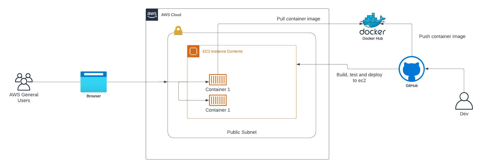

# DevOps Test microservice


This document describes what has been done and how and lastly how to use the created configuration files.


## Infrastructure

I have started this project by creating Terraform files to provision EC2 instance where the application will be deployed using docker-compose and Github-actions, I have have used predefined [AWS modules](https://github.com/terraform-aws-modules) created by AWS community to create the supporting ressources like the VPC, security group and the EC2 instance itself, I have used Ansible also to do after provisioning machine configuration like installing all dependencies and deploying the application.



## Dockerizing the microservices

After the application host was ready I have started by testing the application to see how it works and understand the flow of the traffic and how the microservices are related to each other so I can start making needed changes to have successful migration of the microservices to containers, then I made the necessary changes to the code and created dockerfiles, after the images was ready I created docker-compose file gathering all the microservices together and deployed the compose file to remote server for tests I have add nginx container to the docker-compose file as reverse proxy to serve the front end and the expose backend services.


## Creating CI/CD

When the application was working properly I have moved working on CI/CD pipeline using Github-action as the code is already on github, The pipeline is triggered on push,pull_request or manually it have first job as files checker to decide which microservice should be built and deployed the other jobs as specific per microservice but most steps are similar.


## Monitoring & logs

I have used Prometheus for metrics collection and Grafana for metrics visualization, node_exporter for containers host metrics and cadvisor for containers metrics collection, for logs I have used Promtail and Loki.


## How to use

Deployer need to have latest Terraform and Ansible installed on his machine, we need also domain names for exposed services to add A DNS entry with the deployed server Ip.


### Change domain name

clone the repository
```
cd ~/ && git clone https://github.com/bidandows/devops-test.git
```

The deployer need to change some files with the desired domain name to be used, here list of the files

```
devops-test/client/Dockerfile
devops-test/deploy/nginx_config/*
```

### Add variables to github to be used by the CI

Here is the list of needed variables:

- DOCKERHUB_TOKEN :Dockerhub personel access token
- DOCKERHUB_USERNAME: Dockerhub username it's used to deploy to Dockerhub 
- HOST: Application host IP
- PAT: Github personal access token
- PORT: Host ssh port number
- SSH_PRIV_KEY: Host private key created by Terraform during the provisioning
- USERNAME: Host ssh username

### Start the provisioning and the application deployment

Lastly we need to export some AWS credential variables to the deployer shell so Terraform can have access to AWS
```
export AWS_ACCESS_KEY_ID="****************"
export WS_SECRET_ACCESS_KEY="***********************"
export AWS_DEFAULT_REGION="eu-west-3"
```
Init terraform
```
cd ~/devops-test/Infrastructure
terraform init
terraform apply -auto-approve
```
when the command finish it will output the server ip address, so you can now add this ip to you name server and to github repository variables, then the application should be accessible via that domain name 


 